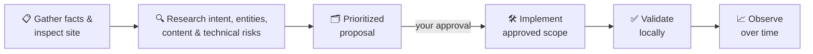

<div align="center">

# Han AEO v1

**Evidence-led Agent Skill for AEO, AI SEO, entity strategy, and approval-gated site changes.**


[Quick Start](#-quick-start) · [How It Works](#-how-it-works) · [What It Produces](#-what-it-produces) · [Mock Project](#-mock-project) · [Optional Integration](#-optional-integration) · [License](#-upload-and-license)

</div>

---

Han AEO v1 helps an agent research a site, build an evidence base, prepare a prioritized proposal, and carry out **only the scope you approve** — with every material claim labeled by confidence, change status, observation status, and source.

> **It is a set of Markdown/YAML instructions for AI agents.**
> It is **not** a SaaS product, website, crawler, or GUI application.

## 🚀 Quick Start

Clone the repository, then copy the skill directory to `$HOME/.agents/skills/han-aeo-v1`:

```bash
git clone https://github.com/hanco1/han-aeo-v1.git
cd han-aeo-v1
mkdir -p "$HOME/.agents/skills"
cp -R han-aeo-v1 "$HOME/.agents/skills/han-aeo-v1"
```

<details>
<summary><b>Windows (PowerShell)</b></summary>

The same destination is `$env:USERPROFILE\.agents\skills\han-aeo-v1`:

```powershell
git clone https://github.com/hanco1/han-aeo-v1.git
Set-Location han-aeo-v1
New-Item -ItemType Directory -Force "$env:USERPROFILE\.agents\skills" | Out-Null
Copy-Item -Recurse -Force ".\han-aeo-v1" "$env:USERPROFILE\.agents\skills\han-aeo-v1"
```

</details>

Open a new agent session after copying it so the skill list is discovered again.

<details>
<summary><b>Optional: validate the installed skill</b></summary>

This step requires OpenAI Codex's `skill-creator` to be installed — `quick_validate.py` ships with Codex, not with this repository. Skip it if you don't use Codex:

```powershell
python "$env:USERPROFILE\.codex\skills\.system\skill-creator\scripts\quick_validate.py" "$env:USERPROFILE\.agents\skills\han-aeo-v1"
```

The skill itself does not depend on Python; Python is only needed when running this validator.

</details>

## 🧭 How It Works

Start with a clear goal, the site URL, and the facts the agent may rely on:

```text
Use $han-aeo-v1 to audit this site for AEO and SEO. Build the evidence base and a prioritized proposal first. Wait for my approval before making any changes.
```

The default workflow is short:



Every material claim carries four independent evidence fields:

| Field | Values |
|---|---|
| **Confidence** | `verified` / `inference` / `hypothesis` |
| **Change status** | `not-applicable` / `proposed` / `implemented-locally` / `deployed` |
| **Observation status** | `not-measured` / `observing` / `observed` |
| **Source** | a named source (`owner`, `repository`, `live-site`, …) plus its date |

A recommendation is not implementation. Implementation is not proof of indexing, rankings, or AI citations; those need post-release observation.

## 📦 What It Produces

Depending on the task, the skill can produce:

- a fact/claim ledger,
- a keyword–entity–page map,
- a content brief,
- a technical change proposal,
- a release checklist,
- a measurement plan.

It does not add `llms.txt` by default. Consider it only when it fits the approved scope.

## 🧪 Mock Project

[`examples/mock-aeo-project/`](examples/mock-aeo-project/) contains three prefilled fake-data text files, not a website or program. There is nothing to run:

| File | Role |
|---|---|
| `site-facts.yaml` | The input: fictional business facts |
| `ai-visibility-prompts.md` | The questions: example questions to test or research |
| `strategy-brief.md` | The proposal: a sample strategy and approval brief |

## 🔌 Optional Integration

[`last30days`](docs/integrations/last30days.md) is an optional, separately installed research skill. It can supply additional customer-language findings, but it is not part of the main Han AEO workflow.

## 📄 Upload and License

Licensed under the [MIT License](LICENSE). [UPLOAD_REVIEW.md](UPLOAD_REVIEW.md) records the pre-publication review completed before this repository was made public.
