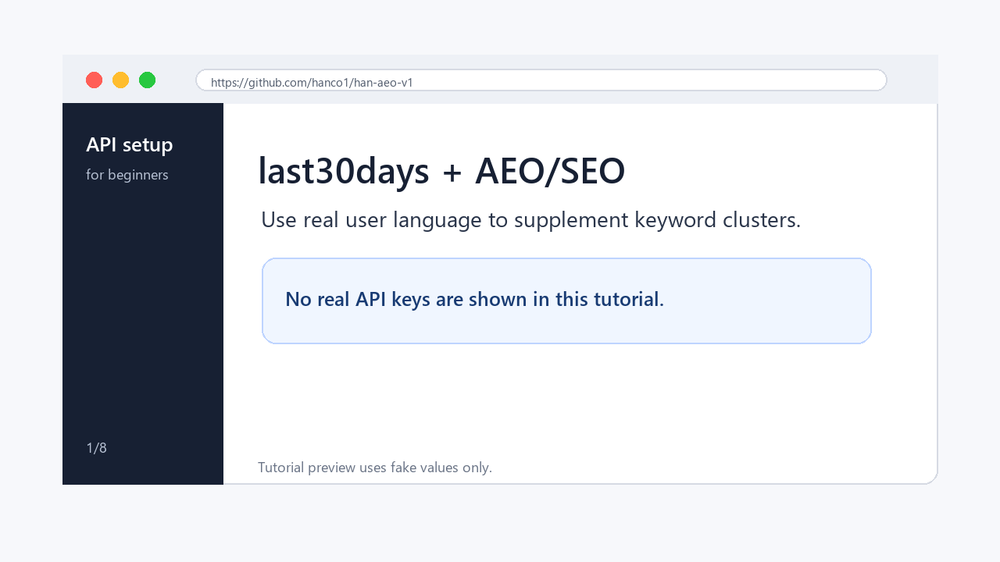

<h1 align="center">Han AEO v1</h1>

<p align="center">
  Evidence-governed AEO / AI SEO skill for keyword research, entity strategy, approval-gated implementation, and measurement.
</p>

<p align="center">
  
  
  
  
</p>

<p align="center">
  <a href="#quick-start">Quick Start</a>
  |
  <a href="#what-this-skill-does">What It Does</a>
  |
  <a href="#what-you-need">What You Need</a>
  |
  <a href="#usage">Usage</a>
  |
  <a href="#what-you-get">Results</a>
  |
  <a href="#last30days-keyword-supplement">last30days</a>
</p>



`han-aeo-v1` is a reusable Codex skill for running AEO, AI SEO, GEO, entity SEO, local SEO, technical SEO, answer-first content planning, keyword/entity/page mapping, browser-assisted verification, and measurement.

It is designed for beginner-friendly but evidence-governed SEO work: the agent researches first, proposes a plan, waits for approval, then executes only the approved scope.

## Quick Start

Clone this repository, then copy only the skill folder into your personal Codex skills directory:

```powershell
git clone https://github.com/hanco1/han-aeo-v1.git
cd han-aeo-v1
Copy-Item -Recurse -Force ".\han-aeo-v1" "$env:USERPROFILE\.codex\skills\han-aeo-v1"
```

Validate the skill:

```powershell
python "$env:USERPROFILE\.codex\skills\.system\skill-creator\scripts\quick_validate.py" "$env:USERPROFILE\.codex\skills\han-aeo-v1"
```

Expected output:

```text
Skill is valid!
```

Open a new Codex session after installation so the skill list can be rediscovered.

## What This Skill Does

Use this skill when you want to improve how a website is discovered, understood, cited, and measured by search engines and AI answer systems.

It helps with:

- AEO / AI SEO strategy.
- Keyword, entity, and page mapping.
- Search intent and FAQ discovery.
- Technical SEO checks: metadata, canonical URLs, robots, sitemap, raw HTML, JSON-LD, `llms.txt`.
- Answer-first content briefs.
- Local SEO and entity consistency.
- Multilingual SEO planning.
- AI visibility testing.
- Google Search Console / Bing submission planning.
- Release validation and measurement reports.

The skill does not treat implementation as SEO success. Indexing, rankings, AI mentions, citations, and qualified inquiries require a dated observation window.

## What You Need

### Required for installation

- Codex desktop or CLI with local skills enabled.
- Git to clone this repository.
- Python 3.10+ to run the validator and helper script.

### Required for a strategy-only workflow

- A website URL.
- Basic business facts: name, services/products, locations, languages, target customers, conversion goal.
- A clear goal, such as "improve service page AEO" or "find keyword clusters for a local service business."

### Required for implementation

One of these:

- code repository access;
- CMS access, such as WordPress, Shopify, Webflow, Wix, or similar;
- website export/files.

You may also need deployment access, such as Vercel, Netlify, Cloudflare, hosting, or server access, only when approved changes must be published.

### Do you need hosting or server login?

Not for audit, strategy, or keyword research. You only need repository, CMS, host, or server access when you want the skill to edit files, publish pages, deploy changes, or verify logged-in production dashboards.

If an action affects Google Search Console, Bing Webmaster Tools, a CMS, hosting, or server settings, the skill should prepare the exact runbook and wait for explicit approval before taking action.

### Optional for measurement and submission

- Google Search Console.
- Bing Webmaster Tools.
- GA4 or analytics exports.
- Rank tracking or keyword tool exports.
- Browser access through Chrome when logged-in dashboards are needed.

### Optional APIs for `last30days`

The skill can use `last30days` as a keyword supplement to discover real-user language from social, video, and community sources.

No API key is required to start the main AEO workflow. The optional keys below only expand `last30days` coverage.

The base `last30days` setup can work with Reddit, YouTube, Hacker News, Polymarket, and GitHub. These optional keys unlock deeper coverage:

| Environment variable | Unlocks | Best for |
|---|---|---|
| `SCRAPECREATORS_API_KEY` | TikTok, Instagram, Threads, Reddit fallback | creator/social language and trend phrasing |
| `XAI_API_KEY` | X/Twitter-style recent conversation path | public reactions and current discussion |
| `BRAVE_API_KEY` | Brave Search backend | web context and auto-resolve when WebSearch is unavailable |
| `OPENROUTER_API_KEY` | optional deep research route | deeper summaries, not required for basic keyword work |

Tool/model note: the main AEO flow uses the current Codex model. `last30days` is a separate local skill/CLI that may call Python, `yt-dlp`, `gh`, and the optional APIs above. `OPENROUTER_API_KEY` is optional, not required for the baseline keyword supplement.

See [docs/last30days-api-setup-tutorial.md](docs/last30days-api-setup-tutorial.md) and [docs/tutorial-gif-storyboard.md](docs/tutorial-gif-storyboard.md).

## Usage

Basic audit prompt:

```text
Use $han-aeo-v1 to audit this website for AEO/SEO. Start with facts, keyword/entity/page mapping, technical SEO risks, and a proposal. Wait for my approval before implementation.
```

Keyword strategy prompt:

```text
Use $han-aeo-v1 for keyword/entity strategy. Help me choose which optimization tracks matter, research the priority clusters, and propose keyword allocation by intent.
```

Implementation prompt:

```text
Use $han-aeo-v1 to implement the approved AEO plan in this repo. Keep changes minimal, validate metadata/schema/robots/sitemap/raw HTML, and report what still requires observation.
```

Browser/submission prompt:

```text
Use $han-aeo-v1 to prepare Google Search Console and Bing submission steps for the approved release. Do not submit anything until I approve the exact URLs and actions.
```

`last30days` keyword supplement prompt:

```text
/last30days bridal makeup booking concerns --agent
```

Then map the findings into FAQ ideas, service page headings, answer-first sections, trust/proof sections, and long-tail query clusters.

## Beginner Workflow

1. Choose the optimization track: full audit, keyword/entity strategy, technical SEO, answer-first content, local authority, multilingual SEO, AI visibility, release/submission, or experiment review.
2. Give the agent the website URL and business facts.
3. Let the agent inspect the current site/repo and build an evidence base.
4. Review the proposed AEO/SEO strategy.
5. Approve or revise the plan.
6. Let the agent execute only the approved scope.
7. Validate the implementation.
8. Observe results over time with Search Console, Bing, analytics, and AI visibility tests.

## What You Get

Depending on the selected track, the skill can produce:

- Business fact and claim ledger.
- Keyword/entity/page cluster map.
- Keyword allocation by intent, not keyword stuffing.
- Priority backlog.
- AEO content brief.
- Technical SEO change plan.
- JSON-LD and `llms.txt` recommendations.
- Browser/submission runbook.
- Change report.
- Release validation report.
- Weekly search and AI visibility report.
- 30/60/90 day iteration plan.

## last30days Keyword Supplement

`last30days` is useful for discovering how real people currently phrase problems, objections, recommendations, comparisons, and questions.

Use it as a supplement, not as the only keyword source. It does not replace:

- Search Console query data;
- keyword volume tools;
- SERP checks;
- business facts;
- competitor page review;
- analytics and conversion data.

Good topics:

```text
/last30days bridal makeup booking concerns --agent
/last30days graduation photo makeup questions --agent
/last30days how people choose a makeup artist --agent
```

Weak topics:

```text
/last30days makeup
/last30days seo keywords
```

## Chrome and Browser Use

Chrome is only needed when the task depends on your logged-in browser state, such as:

- Google Search Console;
- Bing Webmaster Tools;
- GA4 dashboards;
- AI visibility tests in logged-in tools;
- browser screenshots for release evidence;
- API-key tutorial recording.

The skill should prefer local code checks and official APIs when possible. It should not submit URLs, validate fixes, publish pages, or change dashboards without explicit approval.

## Mock Project

The repository includes a sanitized mock project for examples and tests:

```text
examples/mock-aeo-project/
|-- ai-visibility-prompts.md
|-- site-facts.yaml
`-- strategy-brief.md
```

The mock project uses fictional business facts and placeholder domains only.

## Skill Structure

```text
han-aeo-v1/
|-- SKILL.md
|-- agents/
|   `-- openai.yaml
|-- references/
|   |-- aeo-workflow.md
|   |-- browser-automation.md
|   |-- keyword-research.md
|   `-- output-templates.md
`-- scripts/
    `-- aeo_plan_scaffold.py
```

Repository support files:

```text
docs/
|-- last30days-api-setup-tutorial.md
`-- tutorial-gif-storyboard.md
assets/tutorials/
`-- last30days-api-setup-preview.gif
scripts/
`-- render_tutorial_gif.py
examples/mock-aeo-project/
```

## Local Script

Generate a reusable strategy approval brief:

```powershell
python .\han-aeo-v1\scripts\aeo_plan_scaffold.py --project "Example Brand" --domain "https://example.com" --track keyword-entity --track technical-seo --output aeo-brief.md
```

## Safety

Do not commit:

- real client source archives;
- API keys;
- `.env` files;
- credentials or certificates;
- Search Console exports;
- analytics exports;
- logged-in screenshots;
- private business facts.

See [UPLOAD_REVIEW.md](UPLOAD_REVIEW.md) for the current upload review.

## Source Lineage

This repository was created from a private AEO implementation workflow and then sanitized into a reusable mock-safe skill. Private client names, domains, addresses, contacts, and evidence artifacts were removed before upload.

The `last30days` supplement references the public [`mvanhorn/last30days-skill`](https://github.com/mvanhorn/last30days-skill) workflow idea for recent community-language research.

## License

No open-source license has been selected yet. Keep the repository private unless a license and public-release review are completed.
